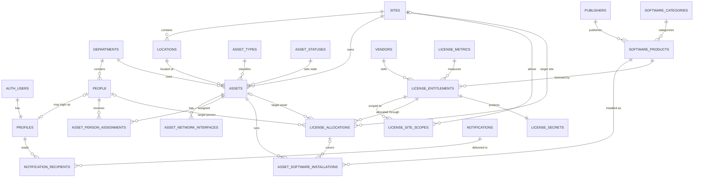

# Database Design

## Software Asset Management — Thai Kurabo

| รายการ | ค่า |
|---|---|
| Database | PostgreSQL บน Supabase |
| Application | Next.js 16 App Router |
| ขอบเขตองค์กร | Single-tenant: Thai Kurabo |
| พื้นที่เริ่มต้น | Factory และ Bangkok Office |
| Identity | Supabase Auth |
| สิทธิ์ MVP | `admin`, `user` |
| Timezone แสดงผล | `Asia/Bangkok` |
| เอกสารอ้างอิง | `PRD.md` และฟีเจอร์ UI ปัจจุบัน |

เอกสารนี้เป็น Technical Database Design สำหรับเปลี่ยนระบบจาก Mock Repository ไปใช้ Supabase โดยรักษาหลักการสำคัญจาก PRD ได้แก่ การแยก Asset ออกจาก License, ใช้ Allocation เป็นแหล่งจริงของจำนวนการใช้งาน, ปกป้อง License Key/Serial Number, ใช้ Soft Delete และมี Audit Trail ครบถ้วน

---

## 1. ขอบเขตและการตัดสินใจที่อนุมัติแล้ว

1. ระบบรองรับ Thai Kurabo องค์กรเดียว แต่เพิ่ม Site ได้หลายแห่ง
2. ไม่เพิ่ม `organization_id` ในทุกตาราง เพราะยังไม่มีความต้องการ multi-tenant
3. ใช้สถาปัตยกรรม Hybrid:
   - ข้อมูล non-sensitive อยู่ใน `public` และป้องกันด้วย grants + RLS
   - Secret อยู่ใน `private`/Supabase Vault และไม่เปิดผ่าน Data API
   - Audit และ Migration แยก schema
4. User เปิดดูข้อมูลและรายงานได้ แต่ไม่มีสิทธิ์ mutation ข้อมูลธุรกิจ
5. Admin mutation ผ่าน database RPC/Next.js Server Action ไม่เขียนตารางสำคัญโดยตรงจาก browser
6. License Key และ Serial Numberต้องรองรับ:
   - แสดงค่าปกปิดแก่ User
   - เปิดดูค่าจริงแก่ Admin
   - ตรวจค่าซ้ำแบบ exact logical match
   - ไม่รองรับค้นหาบางส่วน
7. Excel ทั้งสองไฟล์ใช้เฉพาะ Initial Migration ไม่สร้างเมนู import หลัง Go-live
8. `license_allocations` เป็น source of truth ของ `allocated_quantity`

### 1.1 สิ่งที่ไม่รวมใน MVP

- Multi-tenant
- Procurement approval workflow
- Fixed asset accounting/depreciation
- Scheduled Excel import
- Email/LINE/Teams notification
- Attachment storage; schema เตรียม reference ไว้แต่ยังไม่สร้าง Storage policy
- Hardware discovery agent

---

## 2. PostgreSQL Schema Boundary

| Schema | หน้าที่ | เปิดผ่าน Supabase Data API |
|---|---|---|
| `auth` | Supabase Auth users, sessions และ identities | จัดการโดย Supabase; ไม่ expose โดยตรง |
| `public` | Operational data, safe views และ RPC entry points | เปิดเฉพาะ object ที่กำหนด grants/RLS |
| `private` | Secret references, security helpers และ internal functions | ไม่เปิด |
| `audit` | Append-only audit events | ไม่เปิดโดยตรง; Admin อ่านผ่าน safe view/RPC |
| `migration` | Initial import staging และ reconciliation | ไม่เปิดแก่ application หลัง Go-live |

Supabase project ต้อง expose เฉพาะ `public` schema เท่านั้น และต้อง revoke default privileges ที่ไม่จำเป็นจาก `anon` และ `authenticated`

---

## 3. Naming และมาตรฐานข้อมูล

### 3.1 Naming

- ตารางและคอลัมน์ใช้ `snake_case`
- Primary key ใช้ชื่อ `id`
- Foreign key ใช้ `<entity>_id`
- Index ใช้ `<table>_<columns>_<type>_idx`
- Unique constraint ใช้ `<table>_<business_rule>_uq`
- Check constraint ใช้ `<table>_<rule>_ck`
- RPC ใช้คำกริยา เช่น `allocate_license`, `release_license_allocation`
- View ลงท้าย `_v`; materialized view ลงท้าย `_mv`

### 3.2 Data types

- Internal ID: `uuid` และสร้างด้วย `gen_random_uuid()`
- Business date: `date`
- Event timestamp: `timestamptz`
- Quantity: `integer`
- IP address ที่เป็น IP จริง: `inet`
- MAC address: เก็บ normalized text รูปแบบ `AA:BB:CC:DD:EE:FF`
- Flexible migration payload/audit changes: `jsonb`
- Version สำหรับ optimistic locking: `integer not null default 1`

### 3.3 Common metadata

ตาราง operational สำคัญใช้คอลัมน์ร่วม:

```text
created_at      timestamptz not null default now()
created_by      uuid null references public.profiles(id)
updated_at      timestamptz not null default now()
updated_by      uuid null references public.profiles(id)
version         integer not null default 1
archived_at     timestamptz null
archived_by     uuid null references public.profiles(id)
```

`updated_at` และ `version` เปลี่ยนด้วย trigger กลาง การ update ผ่าน RPC ต้องรับ `expected_version` เพื่อป้องกันการเขียนทับ concurrent update

### 3.4 Master data convention

Master tables ใช้โครงสร้างอย่างน้อย:

```text
id, code, name_th, name_en, sort_order, is_active,
created_at, created_by, updated_at, updated_by, version, archived_at, archived_by
```

- `code` เป็น stable business code และห้ามแก้หลังถูกใช้งาน
- ชื่อแสดงผลแก้ได้
- รายการที่ถูกอ้างอิงแล้วใช้ Archive ไม่ hard delete

---

## 4. Entity Relationship Diagram



หมายเหตุ: `LICENSE_SECRETS` อยู่ใน `private`; `AUTH_USERS` อยู่ใน `auth`; entity อื่นอยู่ใน `public`

---

## 5. Identity และ People

### 5.1 `public.profiles`

ข้อมูล application-level ของผู้ใช้ Supabase Auth

| Column | Type | Null | กฎ |
|---|---|---:|---|
| `id` | `uuid` | No | PK และ FK ไป `auth.users(id)` |
| `person_id` | `uuid` | Yes | Unique FK ไป `people`; ผู้ใช้ระบบอาจยังไม่ผูกพนักงาน |
| `display_name` | `text` | No | ชื่อแสดงผล |
| `username` | `citext` | Yes | Unique เมื่อมีค่า; รองรับ Login ด้วย Username ผ่าน server auth flow |
| `email` | `citext` | No | Snapshot สำหรับ list/search; unique |
| `app_role` | `app_role` | No | `admin` หรือ `user` |
| `account_status` | `account_status` | No | `active`, `inactive`, `locked` |
| `last_login_at` | `timestamptz` | Yes | เวลาล่าสุดที่ login สำเร็จ |
| `failed_login_count` | `integer` | No | Default 0; จัดการโดย trusted auth flow |
| `locked_until` | `timestamptz` | Yes | เวลาสิ้นสุด lock ชั่วคราว |
| `deactivated_at` | `timestamptz` | Yes | เวลาปิดบัญชี |
| `deactivated_by` | `uuid` | Yes | FK `profiles(id)` |
| Common metadata | — | — | ไม่มี archive; สถานะบัญชีแยกชัดเจน |

กฎ:

- Trigger หลังสร้าง `auth.users` สร้าง profile ขั้นต่ำ
- Username login ต้อง resolve เป็น email ภายใน trusted server route และตอบ error แบบทั่วไปเพื่อไม่เปิดเผยว่าบัญชีมีอยู่หรือไม่
- Failed login counter/temporary lock ต้องประสานกับ Supabase Auth rate limits และ Auth hooks; ห้ามใช้ client เป็นผู้เพิ่ม/ล้าง counter
- Session idle timeout ใน `system_settings` บังคับใช้ที่ Next.js server/session layer เพราะไม่ใช่ row-level database policy
- Function เปลี่ยน role/status ต้องป้องกันการ deactivate/demote Admin คนสุดท้าย
- การสร้าง Invite, Reset Password และลบบัญชีใช้ Supabase Auth Admin API ฝั่ง server เท่านั้น
- `raw_user_meta_data` ไม่ใช้เป็น authorization source

### 5.2 `public.people`

บุคลากรที่เกี่ยวข้องกับ Asset/License ไม่จำเป็นต้องมีบัญชี login

| Column | Type | Null | กฎ |
|---|---|---:|---|
| `id` | `uuid` | No | PK |
| `employee_code` | `text` | Yes | Unique เมื่อมีค่า |
| `display_name` | `text` | No | ชื่อที่ใช้ในระบบ |
| `email` | `citext` | Yes | ไม่บังคับ unique เพื่อรองรับข้อมูล migration ที่ยังไม่สะอาด; warning เมื่อซ้ำ |
| `department_id` | `uuid` | Yes | FK `departments` |
| `primary_site_id` | `uuid` | Yes | FK `sites` |
| `employment_status` | `text` | No | `active`, `inactive`, `unknown` |
| `remark` | `text` | Yes | ห้ามเก็บข้อมูลส่วนบุคคลที่ไม่เกี่ยวข้อง |
| Common metadata | — | — | รองรับ archive |

---

## 6. Organization และ Master Data

### 6.1 ตารางโครงสร้างองค์กร

| Table | คอลัมน์เฉพาะ | Constraints สำคัญ |
|---|---|---|
| `sites` | `code`, `name_th`, `name_en`, `timezone` | `code` unique; timezone เริ่มต้น `Asia/Bangkok` |
| `locations` | `site_id`, `code`, `name`, `description` | unique `(site_id, code)` |
| `departments` | `code`, `name`, `parent_department_id` | `code` unique; parent ห้ามอ้างตนเอง |

Seed เริ่มต้น:

- `sites.code = FACTORY`
- `sites.code = BANGKOK_OFFICE`

### 6.2 ตาราง Master Data

| Table | คอลัมน์/semantic เพิ่มเติม |
|---|---|
| `asset_types` | `code`: PC, NOTEBOOK, SERVER, OTHER |
| `asset_statuses` | `is_operational`, `is_retired`, `requires_allocation_warning` |
| `internet_levels` | `code`, `risk_level`, `description` |
| `software_categories` | Operating System, Office, Database, CAD, Utility, Business Application |
| `license_metrics` | `target_mode`, `is_perpetual`, `allows_multi_seat_allocation` |
| `product_classifications` | เช่น Regular, OEM, Subscription, Perpetual |
| `purchase_forms` | เช่น Package, Volume License, Cloud Subscription |
| `expiration_thresholds` | `days_before_expiry`, `severity`, `is_active` |

`license_metrics.target_mode` ใช้ค่าหนึ่งใน `device`, `named_user`, `concurrent`, `site`, `mixed`

---

## 7. Asset Domain

### 7.1 `public.assets`

| Column | Type | Null | กฎ |
|---|---|---:|---|
| `id` | `uuid` | No | PK |
| `asset_code` | `text` | Yes | Unique เฉพาะค่าที่ไม่ว่าง |
| `migration_reference` | `text` | Yes | ใช้เมื่อ source ไม่มี Asset Code; unique เมื่อมีค่า |
| `computer_name` | `text` | Yes | Unique ภายใน Site เป็นค่าเริ่มต้น |
| `asset_type_id` | `uuid` | No | FK `asset_types` |
| `asset_status_id` | `uuid` | No | FK `asset_statuses` |
| `site_id` | `uuid` | No | FK `sites` |
| `location_id` | `uuid` | Yes | FK `locations`; ต้องอยู่ Site เดียวกัน ตรวจใน RPC |
| `department_id` | `uuid` | Yes | FK `departments` |
| `manufacturer` | `text` | Yes | Hardware maker; ไม่ใช้ Publisher table |
| `model` | `text` | Yes | Model/Type |
| `serial_number` | `text` | Yes | Hardware serial; ไม่ใช่ License secret |
| `purchase_date` | `date` | Yes | ห้ามเป็นอนาคตโดยไม่มี override reason |
| `internet_level_id` | `uuid` | Yes | FK `internet_levels` |
| `risk_access_level` | `text` | Yes | ค่าเฉพาะองค์กรใน MVP |
| `operating_system_product_id` | `uuid` | Yes | FK `software_products` สำหรับ Primary OS |
| `remark` | `text` | Yes | หมายเหตุ |
| Common metadata | — | — | รวม `version` และ archive |

Constraints/Indexes:

```sql
create unique index assets_asset_code_uq
on public.assets (upper(asset_code))
where asset_code is not null and archived_at is null;

create unique index assets_site_computer_name_uq
on public.assets (site_id, upper(computer_name))
where computer_name is not null and archived_at is null;
```

กรณี Computer Name ซ้ำที่ได้รับอนุมัติ ให้ใช้ `computer_name_duplicate_approved_at/by/reason` และเปลี่ยนเป็น validation function แทนการ drop uniqueness โดยไม่มีหลักฐาน การตัดสินใจขั้นสุดท้ายต้องเกิดก่อน production migration

Search index:

- B-tree: `site_id`, `asset_type_id`, `asset_status_id`, `department_id`
- Trigram: normalized `asset_code`, `computer_name`, `manufacturer`, `model`
- Search MAC/IP ผ่าน child table indexes

### 7.2 `public.asset_network_interfaces`

| Column | Type | Null | กฎ |
|---|---|---:|---|
| `id` | `uuid` | No | PK |
| `asset_id` | `uuid` | No | FK Assets; `on delete restrict` |
| `interface_type` | `text` | No | `lan`, `wifi`, `other` |
| `interface_name` | `text` | Yes | เช่น LAN 1, Wi-Fi |
| `mac_address` | `text` | Yes | Normalize uppercase colon format |
| `ip_address` | `inet` | Yes | IPv4/IPv6 จริง |
| `address_mode` | `text` | No | `static`, `dhcp`, `not_connected`, `unknown` |
| `raw_ip_text` | `text` | Yes | เก็บค่าต้นทางพิเศษจาก migration |
| `vlan` | `text` | Yes | VLAN code/name |
| `is_primary` | `boolean` | No | Primary interface ต่อ Asset/Type ได้หนึ่งรายการ |
| Common metadata | — | — | archive แทน delete |

Indexes:

- Unique normalized MAC เมื่อไม่ว่างและไม่ archive; duplicate ใช้ migration issue ไม่ merge อัตโนมัติ
- B-tree `ip_address` สำหรับ exact search
- Partial unique `(asset_id, interface_type)` where `is_primary = true and archived_at is null`

### 7.3 `public.asset_person_assignments`

| Column | Type | Null | กฎ |
|---|---|---:|---|
| `id` | `uuid` | No | PK |
| `asset_id` | `uuid` | No | FK Assets |
| `person_id` | `uuid` | No | FK People |
| `assignment_role` | `text` | No | `primary_user`, `responsible_person`, `additional_user` |
| `valid_from` | `date` | No | เริ่มรับผิดชอบ |
| `valid_to` | `date` | Yes | `NULL` = current |
| `remark` | `text` | Yes | หมายเหตุ |

Partial unique index ป้องกัน current `primary_user` และ `responsible_person` มากกว่าหนึ่งคนต่อ Asset ส่วน `additional_user` มีหลายคนได้

---

## 8. Software Product และ Installation

### 8.1 `public.publishers`

Master ของผู้ผลิตซอฟต์แวร์ แยกจาก Vendor ผู้ขาย ใช้ master convention และ unique `code`

### 8.2 `public.software_products`

| Column | Type | Null | กฎ |
|---|---|---:|---|
| `id` | `uuid` | No | PK |
| `publisher_id` | `uuid` | No | FK Publishers |
| `category_id` | `uuid` | No | FK Software Categories |
| `name` | `text` | No | Product name |
| `version_edition` | `text` | No | ใช้ empty normalized value เมื่อไม่ระบุ |
| `support_status` | `text` | No | `supported`, `eol`, `unknown` |
| `end_of_life_date` | `date` | Yes | หากทราบ |
| `remark` | `text` | Yes | หมายเหตุ |
| Common metadata | — | — | archive |

Unique business key: normalized `(publisher_id, name, version_edition)` สำหรับ row ที่ไม่ archive

### 8.3 `public.asset_software_installations`

ตารางนี้ตอบคำถามว่า “ติดตั้งอะไรบน Asset” และแยกจาก entitlement/allocation

| Column | Type | Null | กฎ |
|---|---|---:|---|
| `id` | `uuid` | No | PK |
| `asset_id` | `uuid` | No | FK Assets |
| `software_product_id` | `uuid` | No | FK Products |
| `license_allocation_id` | `uuid` | Yes | FK Allocation ที่ครอบคลุม installation นี้ |
| `installed_version` | `text` | Yes | Version ที่ตรวจพบจริง |
| `installed_at` | `date` | Yes | Install date |
| `installation_status` | `text` | No | `installed`, `removed`, `unknown` |
| `source` | `text` | No | `manual`, `migration`, `discovery` |
| `removed_at` | `date` | Yes | วันที่ถอน |
| `remark` | `text` | Yes | หมายเหตุ |
| Common metadata | — | — | ไม่มี hard delete |

Unique active installation `(asset_id, software_product_id)`; หากต้องติดตั้งหลาย instance ให้เพิ่ม instance key ใน phase ที่รองรับ discovery

---

## 9. License Domain

### 9.1 `public.vendors`

Master ผู้ขาย/Dealer ใช้ master convention และมี `contact_name`, `email`, `phone`, `remark` แบบ optional

### 9.2 `public.license_entitlements`

| Column | Type | Null | กฎ |
|---|---|---:|---|
| `id` | `uuid` | No | PK |
| `license_reference` | `text` | Yes | Document/License reference; unique เมื่อมีค่าและ active |
| `software_product_id` | `uuid` | No | FK Products |
| `vendor_id` | `uuid` | Yes | FK Vendors |
| `license_metric_id` | `uuid` | No | FK License Metrics |
| `product_classification_id` | `uuid` | Yes | FK Classification |
| `purchase_form_id` | `uuid` | Yes | FK Purchase Form |
| `owned_quantity` | `integer` | Yes | `NULL` = Untracked; เมื่อมีค่าต้อง `>= 0` |
| `record_status` | `license_record_status` | No | `draft`, `active`, `deactivated`, `archived` |
| `scope_mode` | `license_scope_mode` | No | `all_sites`, `selected_sites` |
| `purchase_date` | `date` | Yes | วันที่ซื้อ |
| `start_date` | `date` | Yes | วันที่เริ่มสิทธิ์ |
| `end_date` | `date` | Yes | วันที่สิ้นสุด; Perpetual ต้องเป็น NULL |
| `invoice_reference` | `text` | Yes | Invoice |
| `po_reference` | `text` | Yes | Purchase order |
| `contract_reference` | `text` | Yes | Contract |
| `owner_person_id` | `uuid` | Yes | FK People |
| `owner_name` | `text` | Yes | Legacy owner text |
| `legacy_install_date` | `date` | Yes | ค่าจาก Excel สำหรับ trace เท่านั้น |
| `license_key_masked` | `text` | Yes | Masked display string; ไม่ใช่ ciphertext |
| `serial_number_masked` | `text` | Yes | Masked display string |
| `remark` | `text` | Yes | ห้ามใส่ Secret |
| Common metadata | — | — | version/archive |

Checks:

- `start_date <= end_date` เมื่อมีทั้งสองค่า
- Metric แบบ Perpetual ต้องไม่มี `end_date`
- `record_status = archived` ต้องมี `archived_at`
- Masked fields เขียนได้เฉพาะ internal secret functions
- การเปลี่ยน `owned_quantity` ต้องผ่าน `update_license_entitlement` เพื่อเช็ก active allocation

### 9.3 `public.license_site_scopes`

| Column | Type | Null | กฎ |
|---|---|---:|---|
| `license_entitlement_id` | `uuid` | No | FK License; part of PK |
| `site_id` | `uuid` | No | FK Site; part of PK |
| Common create metadata | — | — | ไม่ต้องมี archive; เปลี่ยนผ่าน RPC |

- `scope_mode = all_sites`: ต้องไม่มี scope rows
- `scope_mode = selected_sites`: ต้องมีอย่างน้อยหนึ่ง scope row
- ตรวจด้วย deferred constraint trigger หรือ RPC transaction

### 9.4 `public.license_allocations`

| Column | Type | Null | กฎ |
|---|---|---:|---|
| `id` | `uuid` | No | PK |
| `license_entitlement_id` | `uuid` | No | FK License |
| `target_type` | `allocation_target_type` | No | `asset`, `person`, `site` |
| `asset_id` | `uuid` | Yes | FK Asset |
| `person_id` | `uuid` | Yes | FK People |
| `site_id` | `uuid` | Yes | FK Site |
| `quantity` | `integer` | No | Default 1; `> 0` |
| `allocation_status` | `allocation_status` | No | `active`, `released` |
| `allocated_at` | `date` | No | วันที่จัดสรร |
| `installed_at` | `date` | Yes | วันที่ติดตั้ง |
| `released_at` | `date` | Yes | วันที่ถอน |
| `released_by` | `uuid` | Yes | FK Profiles |
| `release_reason` | `text` | Yes | บังคับเมื่อ released |
| `override_used` | `boolean` | No | Default false |
| `override_reason` | `text` | Yes | บังคับเมื่อ override |
| `remark` | `text` | Yes | หมายเหตุ |
| Common create/update metadata | — | — | ห้าม delete |

Target integrity constraint:

```sql
check (
  (target_type = 'asset'  and asset_id  is not null and person_id is null and site_id is null) or
  (target_type = 'person' and person_id is not null and asset_id  is null and site_id is null) or
  (target_type = 'site'   and site_id   is not null and asset_id  is null and person_id is null)
)
```

Partial unique indexes ป้องกัน duplicate active allocation:

```sql
unique (license_entitlement_id, asset_id)
where allocation_status = 'active' and asset_id is not null;

unique (license_entitlement_id, person_id)
where allocation_status = 'active' and person_id is not null;

unique (license_entitlement_id, site_id)
where allocation_status = 'active' and site_id is not null;
```

หาก business อนุญาต Allocation หลายก้อนให้ Target เดียวกันในอนาคต ให้เพิ่ม `allocation_line_key`; MVP ป้องกันซ้ำตาม PRD

### 9.5 `private.license_secrets`

| Column | Type | Null | กฎ |
|---|---|---:|---|
| `license_entitlement_id` | `uuid` | No | PK/FK License |
| `license_key_vault_secret_id` | `uuid` | Yes | ID ใน `vault.secrets` |
| `license_key_fingerprint` | `bytea` | Yes | Keyed HMAC สำหรับ exact duplicate |
| `serial_vault_secret_id` | `uuid` | Yes | ID ใน Vault |
| `serial_fingerprint` | `bytea` | Yes | Keyed HMAC |
| `encryption_version` | `smallint` | No | เริ่มต้น 1 |
| `rotated_at` | `timestamptz` | Yes | เวลาหมุน secret |
| `created_at`, `updated_at` | `timestamptz` | No | Internal metadata |

ไม่มี grant แก่ `anon` หรือ `authenticated` และไม่สร้าง public view ที่มี Vault ID/fingerprint

Normalization ก่อน fingerprint:

- License Key: trim, uppercase ASCII, ตัด whitespace และ separator `-` เพื่อให้ formatting ต่างกันถือเป็น key เดียวกัน
- Serial Number: trim, uppercase ASCII, normalize whitespace; ไม่ตัด punctuation อื่น
- Fingerprint: `HMAC-SHA-256(normalized_value, pepper)`
- Pepper เก็บใน Vault แยกจาก data
- Fingerprint มี non-unique indexเพื่อค้น duplicate แต่ไม่ใช้ unique constraint เพราะ Volume License อาจใช้ key ซ้ำโดยถูกต้อง

Masked string ใน `license_entitlements` ถูกคำนวณพร้อมการเขียน Secret เช่น `XXXXX-XXXXX-AB123` และมีเฉพาะ suffix ตาม `system_settings.secret_visible_suffix_length`

---

## 10. Derived Values และ Safe Views

### 10.1 ห้ามเก็บค่าคำนวณซ้ำ

ไม่เก็บคอลัมน์ต่อไปนี้ใน `license_entitlements`:

- `allocated_quantity`
- `available_quantity`
- `compliance_status`
- `expiry_status`

### 10.2 `public.license_compliance_v`

คำนวณจาก License + Active Allocation:

```sql
allocated_quantity = coalesce(sum(quantity) filter (where allocation_status = 'active'), 0)

available_quantity = case
  when owned_quantity is null then null
  else owned_quantity - allocated_quantity
end

compliance_status = case
  when owned_quantity is null then 'untracked'
  when allocated_quantity > owned_quantity then 'over_allocated'
  else 'compliant'
end
```

### 10.3 Lifecycle priority

1. `record_status = archived` → `archived`
2. `record_status = deactivated` → `deactivated`
3. `license_metrics.is_perpetual = true` → `perpetual`
4. `end_date < current_date_at_org_timezone` → `expired`
5. End date อยู่ใน threshold ที่ใกล้ที่สุด → `expiring_30`, `expiring_60`, `expiring_90`
6. อื่น ๆ → `active`

Threshold มาจาก `expiration_thresholds` ไม่ hard-code ใน view การคำนวณวันใช้ business date `Asia/Bangkok` ไม่ใช้ timezone ของ browser

### 10.4 Views ที่ต้องมี

| View | ใช้งาน |
|---|---|
| `asset_inventory_v` | Asset list/detail/report พร้อม Site/Location/Department/OS |
| `asset_current_people_v` | Primary User/Responsible Person ปัจจุบัน |
| `active_allocations_v` | Allocation ที่ยัง active พร้อม target display |
| `license_compliance_v` | Owned/Allocated/Available/Compliance |
| `license_expiry_v` | Lifecycle/วันคงเหลือ/threshold bucket |
| `license_safe_v` | License DTO สำหรับ User/Admin ไม่มี plaintext/ciphertext/fingerprint |
| `dashboard_summary_v` | KPI จากกฎเดียวกับ report |
| `data_quality_v` | Missing/invalid business data |
| `notification_feed_v` | Notification + read state ของ current user |
| `audit_log_admin_v` | Audit สำหรับ Admin เท่านั้น |

ทุก public view ใช้ `security_invoker = true` และ underlying tables ต้องมี RLS/index ที่เหมาะสม ห้ามใช้ owner-bypassing view โดยไม่ตั้งใจ

---

## 11. Transaction และ RPC Contracts

### 11.1 หลักทั่วไป

- Browser อ่าน safe views ได้ตาม RLS
- Direct DML บน operational tables ถูก revoke จาก `authenticated`
- Admin mutation เรียก public RPC ที่ตรวจ `private.is_admin()` แบบ live
- RPC ใช้ `security definer`, `set search_path = ''`, อ้าง object ด้วย fully qualified name และ revoke จาก `public/anon`
- RPC คืน business error code ไม่คืน SQL/stack trace

### 11.2 RPC ขั้นต่ำ

| Function | หน้าที่ |
|---|---|
| `create_asset(payload)` | Validate master/site/location และสร้าง Asset/Network/People atomically |
| `update_asset(id, expected_version, payload)` | Optimistic locking และ audit changes |
| `archive_asset(id, expected_version, reason, acknowledge_allocations)` | เตือน active allocations และ soft delete |
| `create_software_product(payload)` | ป้องกัน duplicate business key |
| `create_license_entitlement(payload, secret_payload)` | สร้าง License, Vault secrets, fingerprints และ masked hints |
| `update_license_entitlement(id, expected_version, payload)` | Block owned ต่ำกว่า allocated ตาม setting |
| `rotate_license_secret(id, secret_type, value)` | เปลี่ยน Vault secret/fingerprint/mask และ audit |
| `reveal_license_secret(id, secret_type, correlation_id)` | Admin-only; audit ก่อนคืน plaintext |
| `allocate_license(payload)` | Lock/check/insert/audit/notification ใน transaction |
| `release_license_allocation(id, expected_version, reason)` | เปลี่ยนเป็น released และเก็บประวัติ |
| `archive_master_data(entity, id, reason)` | ป้องกัน hard delete |
| `set_user_role(profile_id, role, reason)` | ป้องกัน demote Admin คนสุดท้าย |
| `set_user_status(profile_id, status, reason)` | ป้องกัน deactivate Admin คนสุดท้าย |
| `update_system_settings(expected_version, payload)` | Validate และ audit settings |

### 11.3 Allocation transaction

```text
BEGIN
  authenticate session
  assert live admin role
  SELECT entitlement FOR UPDATE
  validate record status and license metric target mode
  validate target exists, active and belongs to allowed Site scope
  validate quantity > 0 and no duplicate active target
  calculate active allocated quantity inside the lock
  apply over-allocation setting:
    block by default
    allow only when override enabled + reason supplied
  INSERT allocation
  INSERT audit event
  UPSERT idempotent notification when full/over-allocated
COMMIT
```

Row lock บน entitlement ป้องกัน Admin สองคนจัดสรร seat สุดท้ายพร้อมกัน

### 11.4 Secret reveal

```text
Next.js Server Action / Edge Function
  → validate current Supabase session
  → call reveal_license_secret with user JWT
  → function checks live profile role/status
  → reads vault.decrypted_secrets by stored Vault ID
  → inserts audit.reveal_secret event without plaintext
  → returns plaintext once
  → response uses Cache-Control: no-store
```

ห้ามเรียก reveal ด้วย service role โดยไม่ส่ง actor identity เพราะจะทำให้ Audit ระบุผู้กระทำไม่ได้

---

## 12. Row Level Security และ Grants

### 12.1 Helper functions

`private.current_profile_id()` คืน `auth.uid()` เมื่อ profile active

`private.is_admin()` ตรวจ `profiles.app_role = admin` และ `account_status = active` จากฐานข้อมูลทุกครั้ง สำหรับ policy ให้เรียกเป็น `(select private.is_admin())` เพื่อลดการประเมินซ้ำต่อ row

### 12.2 Permission matrix

| Object group | `anon` | Authenticated User | Authenticated Admin |
|---|---|---|---|
| Safe Asset/Product/License views | Deny | Select | Select |
| Allocation safe view | Deny | Select | Select |
| Master data active rows | Deny | Select | Select |
| Own profile | Deny | Select limited | Select |
| Other profiles/people | Deny | Select display fieldsที่จำเป็น | Select |
| Own notification recipient | Deny | Select/update `read_at` ผ่าน RPC | Select |
| Audit view | Deny | Deny | Select |
| Operational table DML | Deny | Deny | Deny direct; RPC only |
| Secret/Vault/Migration schemas | Deny | Deny | Deny direct; restricted server/RPC only |

### 12.3 Policy rules

- เปิด RLS ทุก table ใน `public` รวมถึง lookup tables
- เปิด RLS บน `audit.audit_events`
- Revoke all จาก `anon`
- Grant `select` แก่ `authenticated` เฉพาะ table/view ที่จำเป็น
- Grant execute RPC mutation แก่ `authenticated`; function ตรวจ Admin ภายใน
- Service role ใช้เฉพาะ trusted server/background job และห้ามส่ง client
- RLS tests ต้องทดสอบทั้ง allow และ deny สำหรับทุก operation

### 12.4 Sensitive response rule

User ไม่สามารถรับข้อมูลต่อไปนี้ผ่าน UI, RSC payload, Page Source, API, Realtime หรือ Export:

- Plaintext License Key/Serial
- Vault secret ID
- Encrypted ciphertext
- HMAC fingerprint
- Secret pepper
- Audit old/new value ที่เป็น Secret

---

## 13. Notifications และ Background Jobs

### 13.1 `public.notifications`

| Column | Type | Null | กฎ |
|---|---|---:|---|
| `id` | `uuid` | No | PK |
| `notification_type` | `text` | No | `expiring`, `expired`, `full`, `over_allocated`, `asset_retired_with_allocation`, `job_failure` |
| `severity` | `text` | No | `info`, `warning`, `critical` |
| `title` | `text` | No | ไม่มี Secret |
| `message` | `text` | No | ไม่มี Secret |
| `license_entitlement_id` | `uuid` | Yes | FK License |
| `asset_id` | `uuid` | Yes | FK Asset |
| `license_allocation_id` | `uuid` | Yes | FK Allocation |
| `deduplication_key` | `text` | No | Unique idempotency key |
| `event_date` | `date` | No | Business date |
| `resolved_at` | `timestamptz` | Yes | ปิดแจ้งเตือน |
| `created_at` | `timestamptz` | No | Default now |

Constraint ให้ entity FK อย่างน้อยหนึ่งตัวมีค่าเมื่อ notification อ้าง entity

### 13.2 `public.notification_recipients`

Composite PK `(notification_id, profile_id)` พร้อม `delivered_at`, `read_at`, `dismissed_at`

### 13.3 Daily job

Supabase Cron รันอย่างน้อยวันละครั้งหลังเที่ยงคืน `Asia/Bangkok`:

1. Refresh license expiry/compliance query
2. Generate threshold notifications
3. Resolve notification ที่ไม่เข้าเงื่อนไขแล้ว
4. Create recipients
5. บันทึก job audit/metrics

ตัวอย่าง dedup key:

```text
license:<license_id>:expiring:30:<end_date>
license:<license_id>:expired:<end_date>
license:<license_id>:over_allocated:<allocated_quantity>
```

Unique index ทำให้ retry ไม่สร้างรายการซ้ำ

---

## 14. Audit Design

### 14.1 `audit.audit_events`

| Column | Type | Null | กฎ |
|---|---|---:|---|
| `id` | `uuid` | No | PK |
| `occurred_at` | `timestamptz` | No | Default now |
| `actor_profile_id` | `uuid` | Yes | FK Profile; null สำหรับ system job |
| `actor_type` | `text` | No | `user`, `system`, `migration` |
| `action` | `text` | No | create/update/archive/restore/allocate/release/reveal/export/role_change/settings_change/login/logout |
| `entity_type` | `text` | No | Stable entity name |
| `entity_id` | `uuid` | Yes | Generic ID; ไม่ทำ FK เพื่อรักษา log ระยะยาว |
| `description` | `text` | No | Human-readable; ไม่มี Secret |
| `old_values` | `jsonb` | Yes | Allowlisted fields เท่านั้น |
| `new_values` | `jsonb` | Yes | Allowlisted fields เท่านั้น |
| `reason` | `text` | Yes | Override/archive/release reason |
| `ip_address` | `inet` | Yes | เก็บเมื่อ policy องค์กรอนุมัติ |
| `user_agent` | `text` | Yes | เก็บเมื่อ policyอนุมัติ |
| `correlation_id` | `uuid` | Yes | เชื่อม request/app logs |
| `metadata` | `jsonb` | Yes | Structured non-sensitive metadata |

กฎ:

- Append-only: ไม่มี update/delete grant
- Trigger ปฏิเสธ update/delete ยกเว้น controlled retention role
- Secret fields ถูก redact เป็น `[REDACTED]` ก่อน insert
- Reveal event เก็บเพียง license ID, secret type และ actor
- Export event เก็บ report name/filter/row count ไม่เก็บ export content
- Retention เป็น setting ที่ต้องอนุมัติก่อน Production; ค่าออกแบบเสนอ 7 ปี แต่ไม่ purge จนกว่านโยบายเป็นลายลักษณ์อักษร

### 14.2 Authentication events

Supabase Auth logs เป็นแหล่งหลักของ login failure/session event ส่วน application audit บันทึก login success/logout/role-sensitive actions ที่แอปรับรู้ได้ ห้ามสร้าง triggerที่เสี่ยงทำให้ Auth signup/login ล้มเหลวจาก audit outage

---

## 15. System Settings

### 15.1 `public.system_settings`

Single-row table มี key คงที่ `id = 1`

| Column | Type | Default/Rule |
|---|---|---|
| `organization_name` | `text` | Thai Kurabo |
| `timezone` | `text` | `Asia/Bangkok` |
| `date_format` | `text` | `DD/MM/YYYY` |
| `session_timeout_minutes` | `integer` | Positive; final policy ก่อน production |
| `max_login_failures` | `integer` | Positive |
| `secret_visible_suffix_length` | `smallint` | 0–8 |
| `over_allocation_policy` | `text` | `block` default; `allow_with_reason` optional |
| `default_page_size` | `smallint` | 10–100 |
| `audit_retention_months` | `integer` | เสนอ 84; ต้องอนุมัติก่อน purge |
| Common update metadata | — | optimistic locking + audit |

Expiration thresholds แยก table เพื่อรองรับหลายค่า 30/60/90 โดยไม่ใช้ array ใน settings

---

## 16. Reports

รายงานทั้งหมดอ่านจาก safe views และใช้กฎเดียวกับ Dashboard

| รายงาน | Source หลัก |
|---|---|
| Asset Inventory | `asset_inventory_v` |
| Asset by Site/Location/Department | `asset_inventory_v` group by |
| Asset by Type/Status | `asset_inventory_v` group by |
| Asset by OS | `asset_inventory_v` |
| Software Installed/Allocated by Asset | installations + active allocations |
| License Inventory | `license_safe_v` + compliance/expiry |
| Owned vs Allocated vs Available | `license_compliance_v` |
| Over-allocated | compliance filter |
| Expired | expiry filter |
| Expiring 30/60/90 | expiry bucket |
| Unused License | `allocated_quantity = 0` และ owned > 0 |
| Allocation by Asset/User | `active_allocations_v` + released history option |
| Data Quality | `data_quality_v` |
| Migration Reconciliation | migration reconciliation views |

Export metadata ต้องมี:

- `generated_at`
- `generated_by`
- Report name/version
- Filters
- Row count
- Data as-of date

Export สำหรับ User ใช้ safe columns เท่านั้น แม้ Admin export ก็ไม่ใส่ Secret โดย default; การ export Secret ต้องอยู่นอก MVP และผ่าน approval workflow แยก

เริ่มต้นใช้ regular views ก่อน Materialized View จะเพิ่มเมื่อ query plan/volume แสดงความจำเป็นจริง และต้องมี refresh/consistency strategy ชัดเจน

---

## 17. Initial Excel Migration

### 17.1 Schema

#### `migration.import_batches`

`id`, `batch_name`, `environment`, `status`, `started_at`, `completed_at`, `started_by`, `approved_at`, `approved_by`, `approval_note`

Status: `draft`, `extracted`, `validated`, `dry_run_complete`, `approved`, `committed`, `failed`, `cancelled`

#### `migration.source_files`

`id`, `import_batch_id`, `file_name`, `sha256_checksum`, `file_size_bytes`, `source_modified_at`, `archived_location`, `extracted_at`

Unique `(import_batch_id, sha256_checksum)`

#### `migration.asset_staging_rows`

`id`, `source_file_id`, `sheet_name`, `source_row_number`, `source_row_hash`, `raw_data`, normalized asset/site/location/department/network fields, `validation_status`, `validation_messages`

#### `migration.license_staging_rows`

เก็บ source coordinates, hash, sanitized raw JSON, normalized publisher/vendor/product/version/classification/purchase form/quantity/date/status และ secret presence flags โดยตัด License Key/Serial ออกจาก `raw_data` ตั้งแต่ extraction ค่า Secret plaintext อยู่เฉพาะ memory ระหว่าง transform แล้วเขียน Vault; staging เก็บได้เพียง HMAC fingerprint, masked hint และสถานะการเขียน Vault ห้ามเก็บ plaintext แม้ก่อน committed กฎเดียวกันใช้กับ OS Key ที่พบใน Asset source rows

#### `migration.row_results`

| Column | ความหมาย |
|---|---|
| `staging_entity_type`, `staging_row_id` | Source row |
| `result_status` | `imported`, `merged`, `skipped`, `error` |
| `target_entity_type`, `target_entity_id` | Target |
| `decision_reason` | เหตุผล |
| `decided_by`, `decided_at` | ผู้ตัดสินใจ |
| `errors`, `warnings` | JSON arrays |

#### `migration.mapping_rules`

เก็บ `rule_type`, source value, normalized value/target ID, priority, effective batch, approver และ version เช่น status/publisher/site mapping

#### `migration.reconciliation_runs` / `migration.reconciliation_totals`

เก็บ metric, Site, source total, target total, difference, tolerance, status, checked/approved metadata

### 17.2 Idempotency

- Unique source coordinate `(source_file_id, sheet_name, source_row_number)`
- `source_row_hash` ตรวจ source row เปลี่ยน
- Business matching แยก exact match, probable duplicate และ manual decision
- Rerun batch เดิม reuse `row_results`; ไม่ insert target ซ้ำ
- Target rowsมี `migration_batch_id` และ `migration_source_row_id` สำหรับ traceability จนพ้น retention period

### 17.3 Duplicate rules

Asset candidates:

1. Exact normalized Asset Code
2. Computer Name ภายใน Site
3. Exact MAC
4. Exact IP พร้อม manual review เพราะ IP เปลี่ยน/reuse ได้

License candidates:

1. Reference
2. Product + Version + Vendor + Purchase Date
3. HMAC fingerprint ของ Key/Serial
4. Fingerprint ซ้ำไม่ merge อัตโนมัติ เพราะ Volume License อาจถูกต้อง

### 17.4 Source-to-target summary

| Excel | Target |
|---|---|
| Factory/Office | `sites` |
| Location | `locations` |
| Workgroup | `departments` |
| Code No./Computer Name | `assets` |
| User/Responsible 1–4 | `people` + assignments |
| MAC/IP/VLAN | network interfaces |
| OS/Product columns | products + installations |
| Maker | publishers |
| Dealer | vendors |
| Own License | entitlement owned quantity |
| Use License | Reconciliation control; Allocation หลัง mapping |
| Serial/Key | Vault + private fingerprints |
| Summary/Pivot | Control totals เท่านั้น |

### 17.5 Cutover

1. Archive source + checksum
2. Extract to staging
3. Normalize/map
4. Validate/duplicate scan
5. Generate Data Quality Report
6. Dry run test database
7. Reconcile Factory/Office totals
8. UAT sample approval
9. Final migration in maintenance window
10. Reconcile again
11. Lock migration write permissions
12. Keep source read-only according to retention policy

---

## 18. Index Strategy

สร้าง index บน:

- ทุก Foreign Key ที่ใช้ join/filter
- ทุก RLS predicate เช่น `profile_id`
- Asset: Site, Type, Status, Department, OS
- License: Product, Vendor, Metric, Record Status, End Date
- Allocation: License ID, target FKs, status, allocated/released date
- Notification: recipient/read state, event date, dedup key
- Audit: occurred_at desc, actor, entity `(entity_type, entity_id)`, action, correlation ID
- Migration: batch/file/source coordinates, status, source hash

Search:

- เปิด `pg_trgm`
- GIN trigram index บน normalized Asset Code, Computer Name, Product Name, Version, License Reference และ People display name
- IP ใช้ `inet` B-tree/GiST ตาม query pattern
- MAC ใช้ normalized exact B-tree; partial indexเฉพาะค่าไม่ว่าง

ไม่สร้าง index ทุก column โดยไม่มี query รองรับ ตรวจด้วย `EXPLAIN (ANALYZE, BUFFERS)` ก่อนเพิ่ม composite indexes

---

## 19. Reliability, Retention และ Backup

### 19.1 Soft delete

- Assets, Products, Licenses, People และ Master Data ใช้ archive
- Allocation ใช้ release
- Audit ไม่ลบจาก application
- Hard delete ใช้เฉพาะ staging ก่อน approval หรือ test data ผ่าน privileged maintenance process

### 19.2 Retention

| Data | แนวทาง |
|---|---|
| Operational archived data | เก็บตลอดช่วงที่ยังต้องอ้างรายงาน/License history |
| Audit | ค่าออกแบบเสนอ 84 เดือน; purge หลังนโยบายอนุมัติ |
| Migration staging/raw JSON | เก็บตาม audit policy; จำกัดสิทธิ์สูง |
| Source Excel archive | Read-only พร้อม checksum ตามนโยบายองค์กร |
| Notification | Archive/expire ตาม operational policy |
| Export files | Temporary, private และมี expiry |

### 19.3 Backup/restore

- เปิด automated backup ตาม Supabase plan ที่เลือก
- กำหนด RPO/RTO ก่อน Production โดย Infrastructure owner
- ทดสอบ restore อย่างน้อยก่อน Go-live และตามรอบที่อนุมัติ
- Restore test ต้องตรวจ relational totals, RLS, RPC, Vault secret reveal และ Audit integrity
- การย้ายด้วย manual `pg_dump/restore` ไป Supabase project ใหม่ต้องจัดการ Vault root key ตามขั้นตอน Supabase มิฉะนั้น Secret เดิมจะถอดรหัสไม่ได้

---

## 20. Database Testing Strategy

### 20.1 pgTAP/RLS tests

- ทุก exposed table เปิด RLS
- `anon` อ่าน/เขียนไม่ได้
- User select safe views ได้
- User direct DML ถูกปฏิเสธ
- User เรียก Admin RPC แล้วถูกปฏิเสธ
- Admin เรียก mutation RPC สำเร็จ
- User/Admin query private/audit raw tablesไม่ได้
- Admin audit safe view ได้

### 20.2 Constraint tests

- Asset Code duplicate
- Computer Name duplicate ภายใน Site
- Invalid MAC/IP/date/quantity
- Product duplicate business key
- Perpetual License ที่มี End Date
- Allocation ที่มี target 0 หรือมากกว่า 1 ชนิด
- Duplicate active target
- Release ไม่มี reason
- Archive master data ที่ถูกใช้งาน

### 20.3 Transaction/concurrency tests

- Admin สอง session แย่ง seatสุดท้าย: สำเร็จได้เพียงหนึ่ง
- Over-allocation block default
- Override ต้อง setting + reason + audit
- Owned quantity ลดต่ำกว่า allocated ถูก block
- Release เพิ่ม available quantity และไม่ลบ history
- Retire Asset ที่มี active allocation ต้อง warning/acknowledgement

### 20.4 Secret tests

- Plaintext ไม่ปรากฏใน public table/view/RSC/API/log/audit
- Fingerprint เดียวกันตรวจ duplicate ได้
- Volume key ซ้ำสร้าง warning แต่ไม่ auto merge
- User reveal ถูกปฏิเสธ
- Admin reveal คืนค่าถูกต้องและสร้าง Audit
- Mask suffix ตรง setting
- Secret rotation เปลี่ยน Vault reference/fingerprint/mask อย่างสอดคล้อง

### 20.5 Derived data tests

- Owned NULL → Untracked/Available NULL
- Allocated มาจาก active allocations เท่านั้น
- Released allocation ไม่ถูกนับ
- End date boundary ตาม `Asia/Bangkok`
- 30/60/90 bucket ไม่ทับกัน
- Perpetual/Deactivated/Archived precedence ถูกต้อง
- Dashboard totals เท่ากับ report details

### 20.6 Migration tests

- Excel serial date และข้อความวันที่
- Whitespace/case normalization
- DHCP/Not Connected/OEM/NO KEY
- Missing Asset Code → migration reference + issue
- Source row ทุกแถวมี terminal result
- Rerun ไม่สร้างข้อมูลซ้ำ
- Reconciliation totals ตรง control totals

---

## 21. Migration File/DDL Implementation Order

ลำดับ migration ที่แนะนำ:

1. Extensions: `citext`, `pg_trgm`, Vault, Cron ตาม environment
2. Schemas และ default privilege hardening
3. Enum/system types
4. Identity: profiles/people และ safe auth trigger
5. Organization/master tables + seed values
6. Software product tables
7. Asset tables
8. License entitlement/site scope tables
9. Private secret table/functions
10. Allocation/installations
11. Notifications/settings
12. Audit schema/functions
13. Derived views
14. Transaction RPCs
15. Grants/RLS policies
16. Migration schema
17. Cron jobs
18. pgTAP tests และ seed fixture

ทุก migration ต้องอยู่ใน version control, forward-only เป็นหลัก และมี documented recovery migration แทนการแก้ production schema ผ่าน Dashboard โดยไม่มีไฟล์

---

## 22. Implementation Boundary กับ Next.js

Repository adapter ที่แทน Mock Repository ควรแบ่งเป็น:

```text
SupabaseReadRepository
  - query safe views
  - pagination/filter/sort
  - map database DTO → domain model

SupabaseCommandRepository
  - call validated RPC only
  - pass expected_version/correlation_id
  - map business error codes

SecretService (server-only)
  - reveal secret
  - no-store response
  - never imported into Client Components
```

Next.js Server Components/Route Handlers ต้องไม่ส่ง object ที่มี private fieldsเข้า Client Component แม้ UI จะซ่อนไว้ด้วย CSS หรือ Role check

---

## 23. Business Error Codes

RPC ควรคืน/แปลง error code ที่เสถียร:

| Code | ความหมาย |
|---|---|
| `AUTH_REQUIRED` | ไม่มี session |
| `ACCOUNT_INACTIVE` | บัญชีไม่ active |
| `ACCESS_DENIED` | ไม่มีสิทธิ์ |
| `VERSION_CONFLICT` | ข้อมูลถูกแก้โดยผู้อื่น |
| `DUPLICATE_BUSINESS_KEY` | Asset/Product/Reference ซ้ำ |
| `INVALID_SITE_SCOPE` | Target อยู่นอก scope |
| `INVALID_LICENSE_TARGET` | Metric ไม่รองรับ target type |
| `LICENSE_NOT_ACTIVE` | License ใช้จัดสรรไม่ได้ |
| `ALLOCATION_DUPLICATE` | Target มี active allocation เดิม |
| `INSUFFICIENT_LICENSE` | จำนวนคงเหลือไม่พอ |
| `OVERRIDE_REASON_REQUIRED` | ต้องระบุเหตุผล |
| `ACTIVE_ALLOCATION_EXISTS` | Asset retire/archive มี allocation |
| `LAST_ADMIN_PROTECTED` | ห้าม deactivate/demote Admin คนสุดท้าย |
| `SECRET_NOT_CONFIGURED` | License ไม่มี Secret ชนิดนั้น |

ข้อความที่ส่งผู้ใช้ต้องไม่เปิดเผย SQL, stack trace, Secret หรือข้อมูล entity ที่ผู้ใช้ไม่มีสิทธิ์เห็น

---

## 24. Production Readiness Checklist

- [ ] Supabase project expose เฉพาะ `public`
- [ ] Revoke default grants จาก `anon`
- [ ] RLS และ grants test ผ่านทุก exposed object
- [ ] ไม่มี direct DML grant บน operational tables
- [ ] Service role ไม่ปรากฏใน client bundle
- [ ] Vault และ fingerprint pepper ตั้งค่าครบ
- [ ] Secret reveal no-store/no-log และ Audit ผ่าน
- [ ] Allocation concurrency tests ผ่าน
- [ ] Migration dry run และ reconciliation ผ่าน
- [ ] Factory/Bangkok Office UAT sign-off
- [ ] Backup/restore/Vault reveal drill ผ่าน
- [ ] Audit retention, RPO/RTO และ session policy ได้รับอนุมัติ
- [ ] Cron timezone/idempotency/job-failure alert ผ่าน
- [ ] Query plan ของ Dashboard/List/Report อยู่ในเป้าหมาย NFR
- [ ] Test environment ใช้ masked/synthetic secrets เท่านั้น

---

## 25. เอกสารอ้างอิงทางเทคนิค

- [Supabase: Row Level Security](https://supabase.com/docs/guides/database/postgres/row-level-security)
- [Supabase: Securing the Data API](https://supabase.com/docs/guides/api/securing-your-api)
- [Supabase Auth: Managing User Data](https://supabase.com/docs/guides/auth/managing-user-data)
- [Supabase Auth: Custom Access Token Hook](https://supabase.com/docs/guides/auth/auth-hooks/custom-access-token-hook)
- [Supabase Vault](https://supabase.com/docs/guides/database/vault)
- [Supabase: pgsodium pending deprecation](https://supabase.com/docs/guides/database/extensions/pgsodium)
- [Supabase Cron](https://supabase.com/docs/guides/cron)
- [PostgreSQL: Row Security Policies](https://www.postgresql.org/docs/current/ddl-rowsecurity.html)
- [PostgreSQL: CREATE VIEW / security_invoker](https://www.postgresql.org/docs/current/sql-createview.html)

เมื่อเริ่ม implementation ต้องตรวจ version ของ Supabase/PostgreSQL ใน project จริงอีกครั้งก่อนใช้ extension, view option หรือ Auth hook

---

## 26. สรุป

Database นี้ยึดโมเดล normalized ที่แยก Asset, Software Product, License Entitlement, Software Installation และ License Allocation อย่างชัดเจน Allocation ที่ Active เป็นแหล่งจริงของจำนวนการใช้สิทธิ์ ข้อมูลลับถูกแยกจาก Data API และเปิดดูผ่าน audited server-only flow เท่านั้น ส่วน Excel ถูกจำกัดไว้ใน migration schema เพื่อการนำเข้าครั้งแรกและ reconciliation ก่อน Go-live

โครงสร้างนี้รองรับฟีเจอร์ MVP ทั้ง Dashboard, Asset/License Management, Allocation, Reports, Notifications, User Management, Audit และ Initial Migration โดยไม่เพิ่มความซับซ้อนแบบ multi-tenant ที่ยังไม่จำเป็น และยังรักษาเส้นทางขยายไปยัง Site เพิ่มเติม, discovery, attachments และ external notifications ในอนาคต
